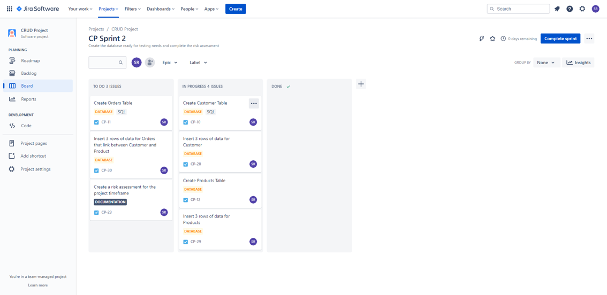

# Grad2GuruProject

## Project Deliverable

A CRUD application that will have a console interface to allow users to manage a Game Shop's day to day activities e.g. customers details, finding their orders and looking at their inventory 

### Core Objectives
 - Be able to create, read, update, view customers from the customer table
 - Be able to create, read, update, view orders from the orders table
 - Be able to create, read, update, view products from the product table

### Additional Features
 - Search functionality for each table by ID
 - Delete all rows from all tables
 - Implement 60% coverage for testing

## Technologies used
- Java
- MySQL
- JUnit (as part of Java)

### ERD

 
 ## Roadmap from JIRA using an MVP/Agile Methodology
 
 
 
 - This was under the impression that documentation and requirements gathering would be done first then alongside delivery the database creation, I would implement the deliverable before the due date.
 - I included the documentation that included creating this readme file.
 - This was to ensure the project scope was covered in its entirety.
 
 ### Sprint 1
 
 
 
 - This sprint's goal was to create diagrams (the ERD in this case) and determine the requirements to build upon. From here the following information was outputted
   - 3 tables would be required
   - CRUD on all 3 tables
   - Search functionality would be required
   - Github would store the deliverable
 
 ### Sprint 2
 
 
 
 - This sprint's goal was to develop the tables on MySQL Workbench. This was developed relatively quickly and tested on MySQL in 2 hours. 
 - The tables needed to primary keys set and require input on some fields on the table. For orders table foreign key restraints were implemented to ensure that the correct referencing was done whenever a row was insertted into the table.
 
 ### Sprint 3
 
 
 
 - This sprint's goal involved user stories that needed to be met an example of this was "As a user, I want to be create a customer in the customers table". This sprint proved to be a demanding sprint compared to the previous sprints as it required to create full functionality of the deliverable.
 
 - This also allowed me to start thinking about how to test the deliverable
 
 
 ### Sprint 4
 
 
 
 - This sprint's goal was to ensure all functionality was covered through coverage and ensured that the deliverable was at the highest standard to meet the requirements.
 
 - This proved to be difficult as it required refactoring code a lot and ensuring the testing was covering as much as possible.
 
 
 
 
